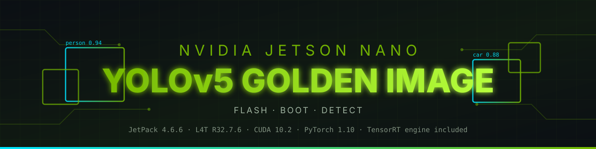
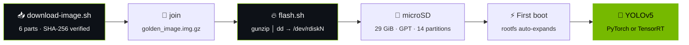

<div align="center">



# Jetson Nano · YOLOv5 · Golden Image

**A ready-to-flash microSD image that turns a stock Jetson Nano into a working YOLOv5 inference box in about 20 minutes — instead of two days of dependency hell.**

[-76B900?style=for-the-badge&logo=nvidia&logoColor=white)](https://developer.nvidia.com/embedded/jetson-nano)
[](https://developer.nvidia.com/embedded/jetpack)
[](https://developer.nvidia.com/embedded/linux-tegra)
[](https://github.com/ultralytics/yolov5)
[](https://pytorch.org)
[](https://releases.ubuntu.com/18.04/)
[-blue?style=for-the-badge)](LICENSE)

<samp>29 GiB raw &nbsp;•&nbsp; 10.25 GiB compressed &nbsp;•&nbsp; 32 GB microSD minimum</samp>

[**Quick start**](#-quick-start) &nbsp;·&nbsp; [**What's inside**](#-whats-inside) &nbsp;·&nbsp; [**Download**](#-download-the-image) &nbsp;·&nbsp; [**Flash**](#-flash-it) &nbsp;·&nbsp; [**Run YOLOv5**](#-run-yolov5) &nbsp;·&nbsp; [**Troubleshooting**](docs/TROUBLESHOOTING.md) &nbsp;·&nbsp; [**ภาษาไทย**](README.th.md)

</div>

---

## 🧨 The problem this solves

Getting YOLOv5 running on a Jetson Nano is famously miserable. The Nano is stuck on **JetPack 4.6.x / Ubuntu 18.04 / Python 3.6 / CUDA 10.2**, which means:

| The trap | What actually happens |
|---|---|
| `pip install torch` | Installs an x86 wheel or a CPU-only build. No CUDA. |
| `pip install torchvision` | No aarch64 wheel exists — you must compile it. ~90 minutes, and it OOMs on 4 GB unless you add swap. |
| `pip install -r yolov5/requirements.txt` | Pulls `numpy`/`opencv`/`Pillow` versions that need Python ≥3.8. Instant breakage. |
| Building anything | 4 GB RAM. `gcc` gets OOM-killed halfway through. |
| Getting real FPS | PyTorch alone gives you single-digit FPS. You need a TensorRT engine, built *on the device*. |

**This image is that whole fight, already won and frozen.** Boot it, and `import torch; torch.cuda.is_available()` returns `True` on the first try.

---

## 📦 What's inside

<table>
<tr><th align="left">Layer</th><th align="left">Version</th><th align="left">Notes</th></tr>
<tr><td><b>L4T</b></td><td><code>R32.7.6</code></td><td>Verified from <code>/etc/nv_tegra_release</code> in the image</td></tr>
<tr><td><b>JetPack</b></td><td><code>4.6.6</code></td><td>The last release line for Jetson Nano</td></tr>
<tr><td><b>OS</b></td><td>Ubuntu 18.04 LTS <code>aarch64</code></td><td>Default user <code>jetson</code></td></tr>
<tr><td><b>CUDA</b></td><td><code>10.2</code></td><td>JetPack 4.6.6 baseline</td></tr>
<tr><td><b>cuDNN / TensorRT</b></td><td><code>8.2.x</code></td><td>JetPack 4.6.6 baseline</td></tr>
<tr><td><b>PyTorch</b></td><td><code>1.10.0</code></td><td>NVIDIA aarch64 CUDA build — <b>not</b> a pip wheel</td></tr>
<tr><td><b>torchvision</b></td><td><code>0.11.x</code></td><td>Compiled from source on-device (<code>/home/jetson/torchvision</code>)</td></tr>
<tr><td><b>YOLOv5</b></td><td><code>v7.0</code></td><td>Full Ultralytics tree with all model YAMLs</td></tr>
<tr><td><b>Weights</b></td><td><code>yolov5n.pt</code></td><td>Nano weights, sized for 4 GB / 128 CUDA cores</td></tr>
<tr><td><b>TensorRT engine</b></td><td><code>yolov5n.engine</code></td><td>Pre-built — the slow part is already done</td></tr>
<tr><td><b>Helpers</b></td><td><code>yolov5_trt.py</code>, <code>yolov5_jetson.sh</code></td><td>TensorRT inference + launcher</td></tr>
</table>

> [!NOTE]
> A TensorRT `.engine` is tied to the exact GPU, TensorRT version, and driver it was built on. Because this image freezes all three, the bundled `yolov5n.engine` loads directly on any Jetson Nano — no 20-minute rebuild on first run.

---

## 🚀 Quick start

```bash
git clone https://github.com/bluebox-dev/Jetson-Nano-YOLOv5-OP.git
cd Jetson-Nano-YOLOv5-OP

./scripts/download-image.sh     # 1. fetch + verify ~10 GB from Releases
./scripts/flash.sh              # 2. pick your SD card, type ERASE
                                # 3. boot the Nano — you're done
```

<div align="center">



</div>

---

## 🖥️ Requirements

| | Minimum | Recommended |
|---|---|---|
| **Board** | Jetson Nano Dev Kit, module **P3448-0000** (4 GB, microSD) | Same, carrier **B01** |
| **microSD** | 32 GB, UHS-I | **64 GB, UHS-I U3 / A2** — SanDisk Extreme or Samsung EVO Select |
| **Power** | 5 V 2 A micro-USB | **5 V 4 A barrel jack + J48 jumper** (required for MAXN / camera work) |
| **Host disk** | ~21 GB free (10 GB download + 11 GB joined) | 40 GB |
| **Host OS** | macOS, Linux, or Windows | — |

> [!WARNING]
> This image targets the **microSD** Jetson Nano (P3448-**0000**). It will **not** boot the 16 GB eMMC production module (P3448-0002) — that variant needs `flash.sh` from the NVIDIA L4T BSP over USB recovery mode instead.

> [!CAUTION]
> Cheap or counterfeit SD cards are the #1 cause of "it boots once then corrupts." A card that fails `f3probe` will fail here too.

---

## 📥 Download the image

The image is **10.25 GiB**, so it is published as **GitHub Release assets**, not committed to git.

<details>
<summary><b>Why isn't the <code>.img.gz</code> in the repo?</b> (click)</summary>

<br>

GitHub enforces hard limits that this file blows straight through:

| Channel | Per-file limit | Verdict for a 10.25 GiB image |
|---|---|---|
| Normal git push | **100 MB** (hard block) | ❌ push rejected |
| Git LFS | **2 GB** per file, 1 GB free storage | ❌ too big, and would cost money |
| **GitHub Releases** | **2 GB per asset**, unlimited assets, free | ✅ **split into 6 parts** |

So `split-image.sh` cuts the image into 1900 MB chunks with a `SHA256SUMS` manifest, `publish-release.sh` uploads them, and `download-image.sh` pulls them back down, verifies each part, and reassembles the original byte-for-byte.

</details>

**Automatic (recommended)** — needs the [GitHub CLI](https://cli.github.com):

```bash
./scripts/download-image.sh
```

**Manual** — download every `golden_image.img.gz.part-*` plus `SHA256SUMS` from the [Releases page](../../releases/latest), then:

```bash
cd image-parts && shasum -a 256 -c SHA256SUMS && cat golden_image.img.gz.part-* > ../golden_image.img.gz
```

### Integrity

| Property | Value |
|---|---|
| File | `golden_image.img.gz` |
| Compressed size | `11,007,254,904` bytes (10.25 GiB) |
| Raw size | `31,138,512,896` bytes (29.00 GiB, 60,817,408 × 512 B sectors) |
| Compression | gzip, 35.4% of original |
| SHA-256 | see [`CHECKSUMS.txt`](CHECKSUMS.txt) |

```bash
./scripts/verify.sh golden_image.img.gz
```

---

## 🔥 Flash it

### macOS / Linux

```bash
./scripts/flash.sh
```

`flash.sh` lists only removable devices, refuses to write to your system disk, checks the card is ≥32 GB, makes you type `ERASE`, unmounts, streams `gunzip → dd` (using `pigz`/`pv` when available), then syncs and ejects. Expect **15–45 minutes**.

<details>
<summary><b>Do it by hand instead</b></summary>

<br>

**macOS** — note `rdisk`, which is roughly 10× faster than `disk`:

```bash
diskutil list external physical
diskutil unmountDisk /dev/diskN
gzip -dc golden_image.img.gz | sudo dd of=/dev/rdiskN bs=4m
sync && diskutil eject /dev/diskN
```

**Linux:**

```bash
lsblk -dpo NAME,SIZE,TYPE,RM,MODEL
sudo umount /dev/sdX?*
gzip -dc golden_image.img.gz | sudo dd of=/dev/sdX bs=4M status=progress conv=fsync
sync && sudo eject /dev/sdX
```

Get `N` / `X` wrong and you erase the wrong disk. There is no undo.

</details>

### Windows

Use **[Balena Etcher](https://etcher.balena.io/)** — it reads `.img.gz` directly, validates the write, and won't offer you your system drive. Point it at `golden_image.img.gz`, pick the card, flash. [Raspberry Pi Imager](https://www.raspberrypi.com/software/) ("Use custom") works too.

### Partition layout written to the card

<details>
<summary><b>All 14 GPT partitions</b> (click)</summary>

<br>

| # | Name | Start (LBA) | Size | Role |
|--:|---|--:|--:|---|
| 1 | `APP` | 28,672 | 28.99 GiB | Root filesystem (ext4) — Ubuntu, CUDA, YOLOv5 |
| 2 | `TBC` | 2,048 | 128 KiB | TegraBoot CPU firmware |
| 3 | `RP1` | 4,096 | 448 KiB | DRAM training / BCT parameters |
| 4 | `EBT` | 6,144 | 576 KiB | CBoot bootloader |
| 5 | `WB0` | 8,192 | 64 KiB | Warm-boot (SC7 resume) blob |
| 6 | `BPF` | 10,240 | 192 KiB | Boot & Power Management firmware |
| 7 | `BPF-DTB` | 12,288 | 384 KiB | BPMP device tree |
| 8 | `FX` | 14,336 | 64 KiB | Fuse bypass |
| 9 | `TOS` | 16,384 | 448 KiB | Trusted OS (TrustZone) |
| 10 | `DTB` | 18,432 | 448 KiB | Kernel device tree |
| 11 | `LNX` | 20,480 | 768 KiB | Linux kernel + initrd |
| 12 | `EKS` | 22,528 | 64 KiB | Encrypted key store |
| 13 | `BMP` | 24,576 | 192 KiB | Boot splash bitmap |
| 14 | `RP4` | 26,624 | 128 KiB | Secondary boot params |

Partitions 2–14 are the Tegra boot chain and live in the gap *before* the rootfs — which is exactly why you must write the **whole image from sector 0**, not just copy files onto a formatted card.

</details>

---

## ⚡ First boot

1. Card in, **HDMI + keyboard + mouse** connected, then power.
2. The green LED lights and the NVIDIA splash appears within ~10 s. First boot takes **2–4 minutes** while the rootfs expands to fill the card.
3. Log in as user **`jetson`**.
4. Immediately do the housekeeping:

```bash
sudo nvpmodel -m 0        # MAXN — all 4 cores, max clocks (needs a barrel-jack PSU)
sudo jetson_clocks        # pin clocks to maximum
sudo /usr/bin/jetson_clocks --show
```

Full checklist, including swap, fan control, and headless setup: **[docs/FIRST_BOOT.md](docs/FIRST_BOOT.md)**

---

## 🎯 Run YOLOv5

### Confirm the stack is alive

```bash
python3 -c "import torch, torchvision; print(torch.__version__, torchvision.__version__, torch.cuda.is_available())"
```

Expected: `1.10.0 0.11.x True`

### PyTorch inference

```bash
cd ~/yolov5
python3 detect.py --weights yolov5n.pt --source data/images --img 640 --device 0
```

### TensorRT inference — the fast path

```bash
python3 yolov5_trt.py --engine yolov5n.engine --source 0     # /dev/video0
```

or just:

```bash
./yolov5_jetson.sh
```

### CSI camera (IMX219 / Raspberry Pi Camera v2)

```bash
gst-launch-1.0 nvarguscamerasrc ! \
  'video/x-raw(memory:NVMM),width=1280,height=720,framerate=30/1' ! \
  nvvidconv ! nvegltransform ! nveglglessink -e
```

If that shows a picture, the camera is fine and any failure is in your Python.

### Measure your own throughput

Published Nano numbers vary wildly with power mode, resolution, and camera pipeline, so this repo ships a benchmark instead of a marketing table:

```bash
./scripts/benchmark.sh          # run on the Nano
```

It reports FPS and latency for PyTorch vs TensorRT at 640 and 416, with `nvpmodel` state recorded. **PRs adding your results to [docs/BENCHMARKS.md](docs/BENCHMARKS.md) are very welcome.**

---

## 🗂️ Repository layout

```
Jetson-Nano-YOLOv5-OP/
├── README.md                  ← you are here
├── README.th.md               ← ภาษาไทย
├── CHECKSUMS.txt              ← SHA-256 of the published image
├── LICENSE                    ← MIT, covers the tooling in this repo
├── scripts/
│   ├── flash.sh               ← write the image to a card (safe, interactive)
│   ├── download-image.sh      ← fetch + verify + join release parts
│   ├── verify.sh              ← checksum a local image
│   ├── split-image.sh         ← maintainer: cut the image into release assets
│   ├── publish-release.sh     ← maintainer: upload to a GitHub Release
│   ├── benchmark.sh           ← on-device FPS/latency measurement
│   └── shrink-image.sh        ← maintainer: zero free space before compressing
└── docs/
    ├── FLASHING.md            ← every host OS, in detail
    ├── FIRST_BOOT.md          ← post-flash checklist
    ├── IMAGE_CONTENTS.md      ← what's installed and where
    ├── BUILD_FROM_SCRATCH.md  ← how to rebuild this image yourself
    ├── BENCHMARKS.md          ← community results
    ├── TROUBLESHOOTING.md     ← it doesn't boot / no CUDA / camera dead
    └── RELEASE_NOTES.md
```

---

## 🛠️ Maintainer workflow

Cutting a new image release:

```bash
./scripts/shrink-image.sh      # on the Nano: zero free space, then re-gzip
./scripts/split-image.sh       # → image-parts/ + SHA256SUMS
./scripts/publish-release.sh v1.0.0
```

Building the whole thing from a stock JetPack SD card is documented step by step in **[docs/BUILD_FROM_SCRATCH.md](docs/BUILD_FROM_SCRATCH.md)** — so this image is reproducible, not a black box.

---

## ❓ FAQ

<details>
<summary><b>Will this work on Orin Nano / Xavier NX?</b></summary><br>
No. This is an L4T R32.7.6 / Tegra X1 image. Orin needs JetPack 5/6 and a completely different boot chain.
</details>

<details>
<summary><b>Can I use a 32 GB card?</b></summary><br>
Yes — the raw image is 29.00 GiB and a nominal 32 GB card is ~29.7 GiB, so it fits with almost nothing to spare. A 64 GB card is strongly recommended; the rootfs auto-expands on first boot and you'll want room for datasets and swap.
</details>

<details>
<summary><b>Can I train on the Nano?</b></summary><br>
Practically, no. 4 GB of shared CPU/GPU memory and 128 Maxwell cores are for inference. Train on a desktop or Colab, export to ONNX, and build the TensorRT engine on the Nano.
</details>

<details>
<summary><b>Why <code>yolov5n</code> and not <code>yolov5s</code>?</b></summary><br>
Nano weights fit the hardware. <code>yolov5s</code> runs, just slower — export it yourself with <code>export.py --include engine</code> and it'll be waiting in <code>~/yolov5</code>.
</details>

<details>
<summary><b>Do I have to change the default password?</b></summary><br>
Yes. Before putting this on any network: <code>passwd</code>, and read the security notes in <a href="docs/FIRST_BOOT.md">FIRST_BOOT.md</a>.
</details>

<details>
<summary><b>The download keeps dying.</b></summary><br>
<code>download-image.sh</code> is resumable — just run it again. It re-verifies every part and only refetches what's missing or corrupt.
</details>

---

## 🤝 Contributing

Issues and PRs welcome — especially benchmark numbers, camera recipes, and host-OS quirks. Please include your L4T version (`cat /etc/nv_tegra_release`), power mode (`nvpmodel -q`), and carrier board revision.

## 📄 License & credits

The **tooling and documentation in this repository** are MIT licensed — see [LICENSE](LICENSE).

The **disk image itself is not**: it is a composite that includes NVIDIA L4T / JetPack (NVIDIA software license agreement), Ubuntu 18.04, and Ultralytics YOLOv5 (AGPL-3.0). Redistribution and any commercial use must comply with each upstream license. YOLOv5's AGPL-3.0 in particular has real obligations if you ship a product built on it — read it.

Built on the shoulders of [NVIDIA Jetson](https://developer.nvidia.com/embedded-computing), [Ultralytics YOLOv5](https://github.com/ultralytics/yolov5), and everyone who has ever posted a working `torchvision` build command on the NVIDIA forums.

<div align="center"><br><sub>⭐ If this saved you a weekend, star the repo.</sub></div>
